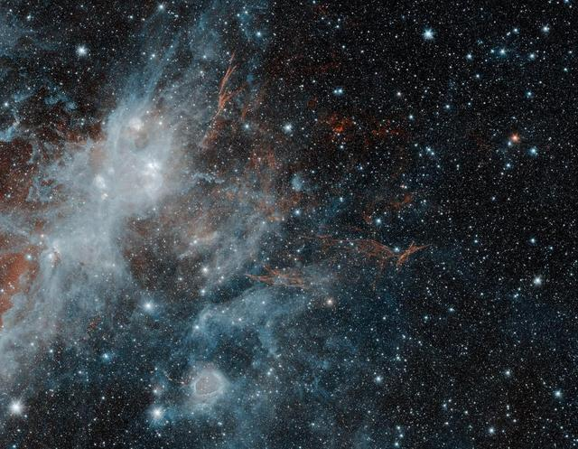
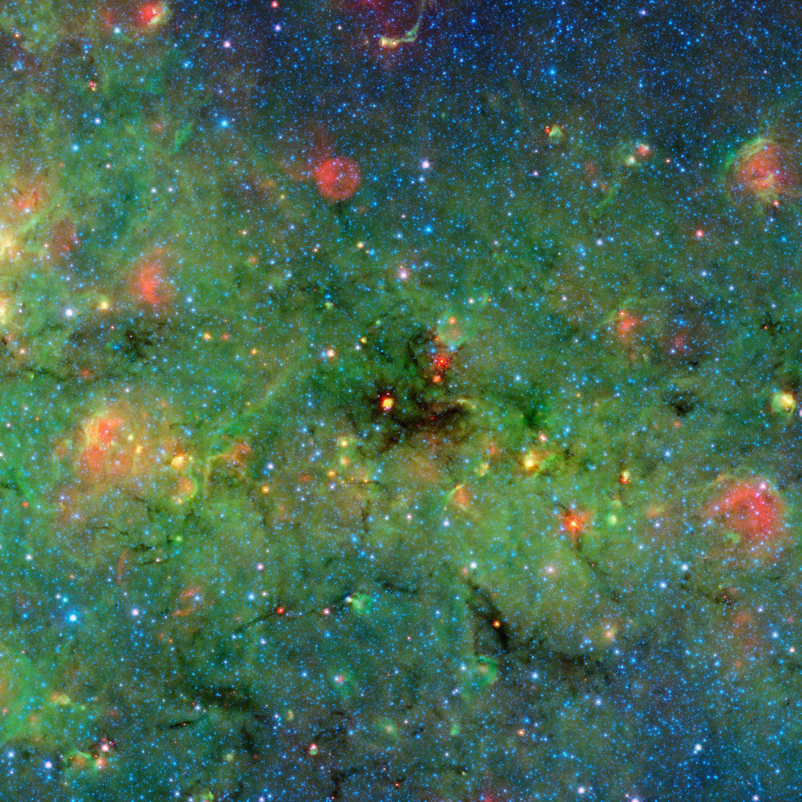
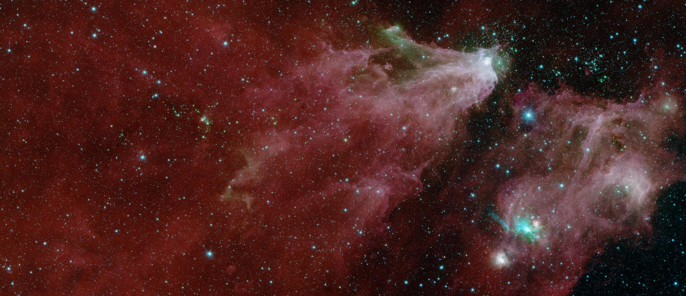

# The Solar Space

## Overview

- All the images used are from NASA(https://images.nasa.gov/)

- This is a project for NASA Space App 2024 challenge.

- This repository contains a collection of mages computed from various images in NASA's gallery. The images have been processed to create sub-images that maintain high quality while allowing for easier analysis and usage in applications.

## Images Sample

## Getting Started

The code might need some update if you are running it after 2024, because of the updates.

I used github codespace for development, if you are doing the same. then,

### Process

1. run npm install

2. run npm start

3. recommend you to create a raw and compute directory before running

